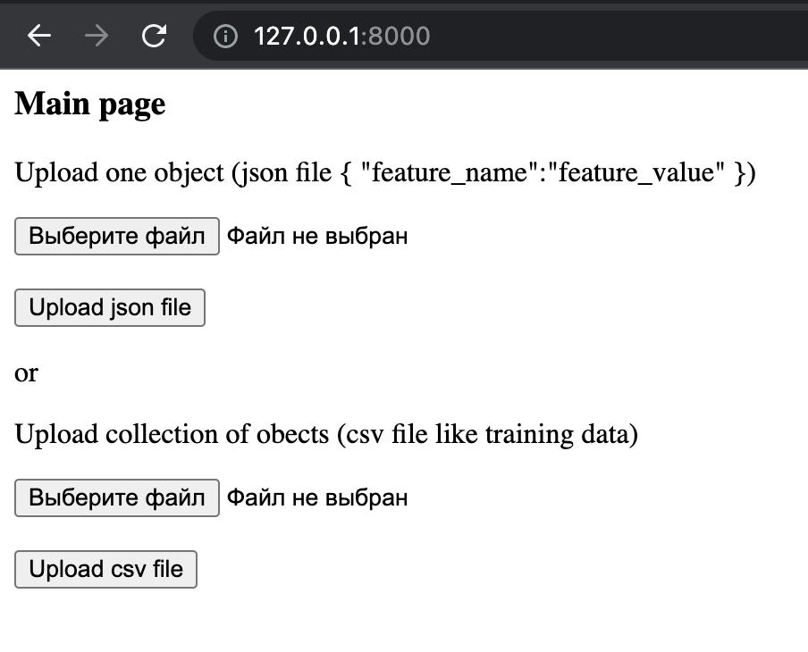
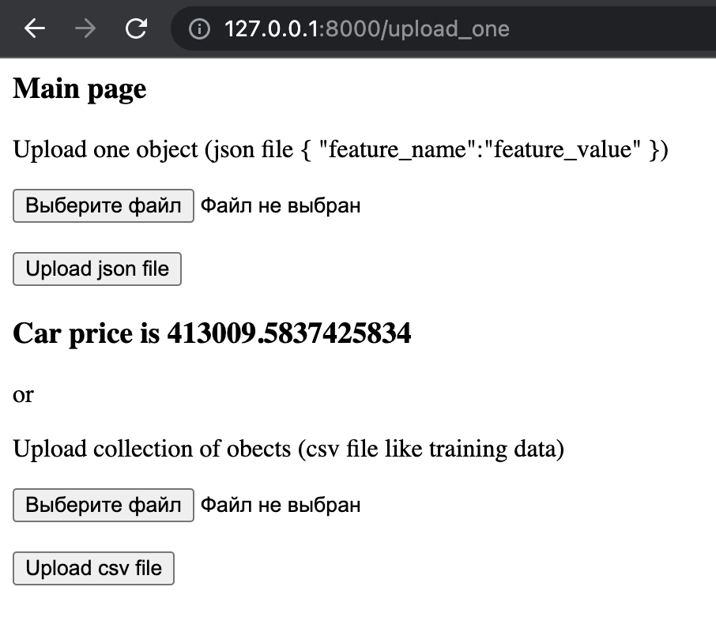
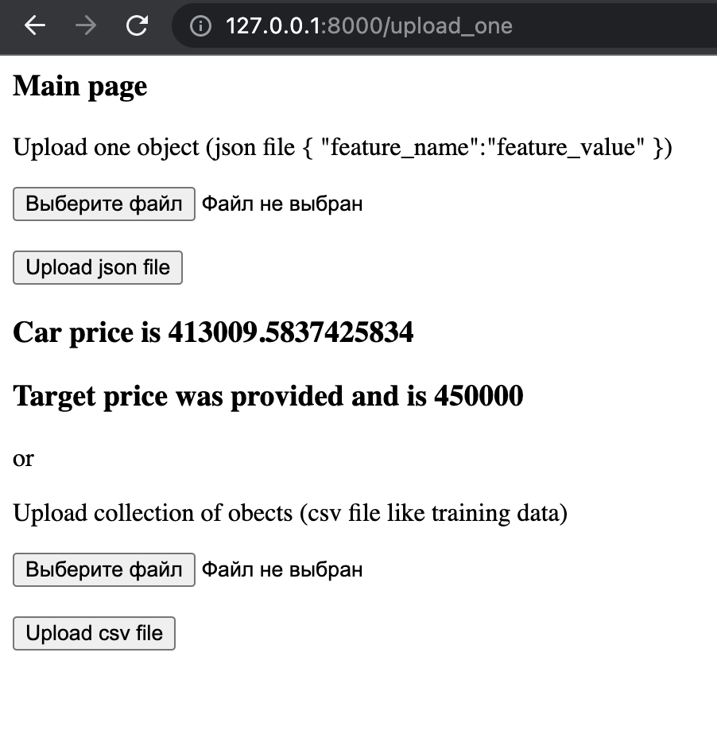
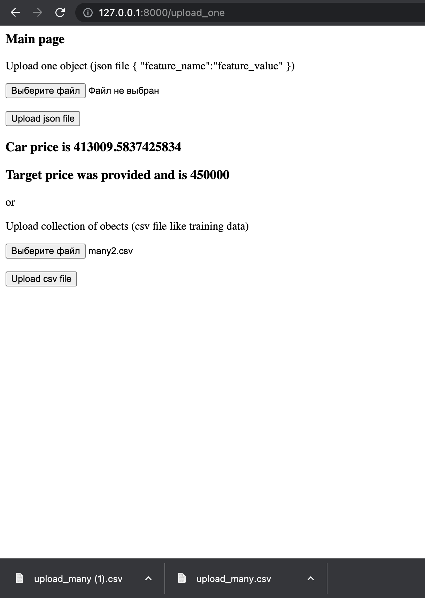
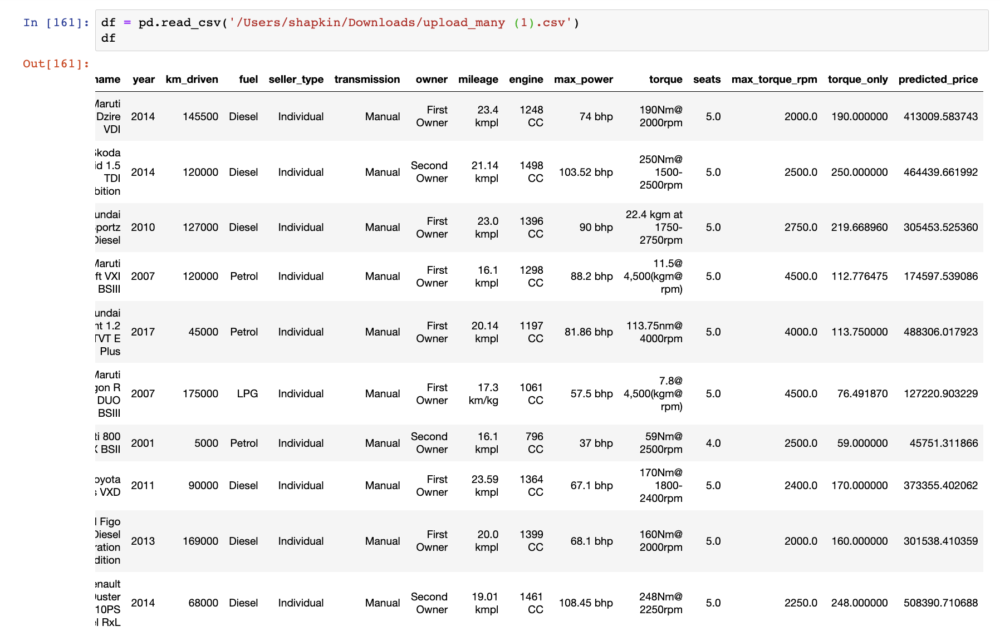
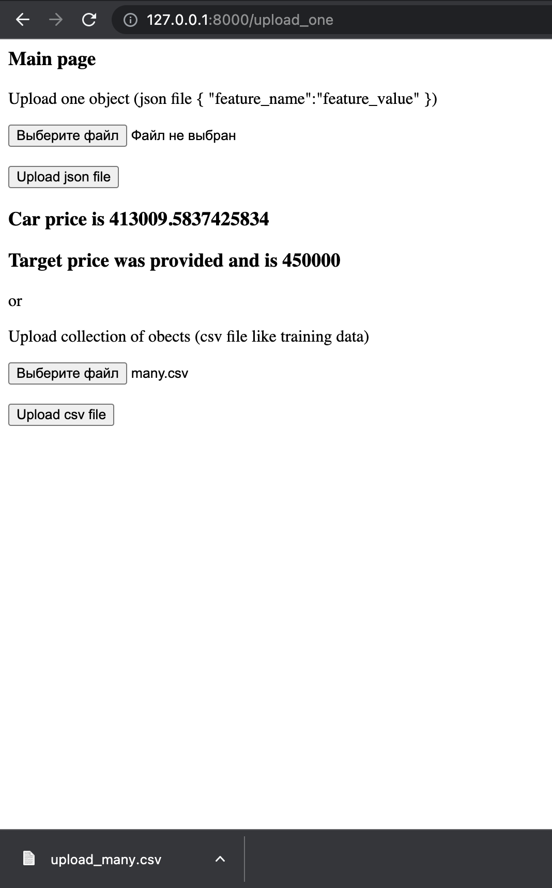
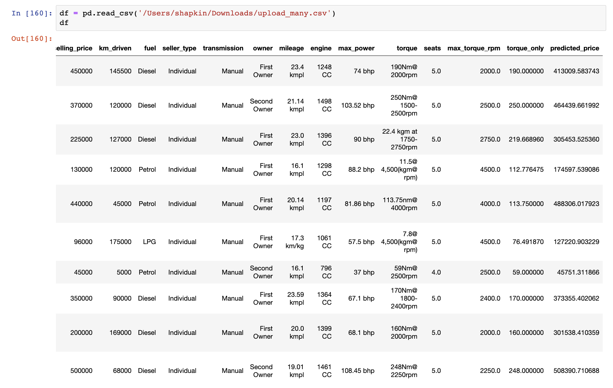
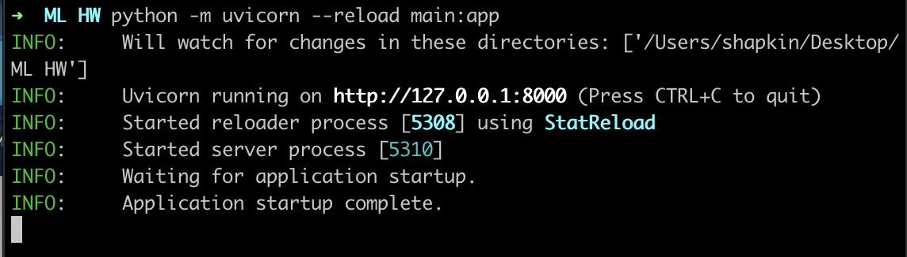
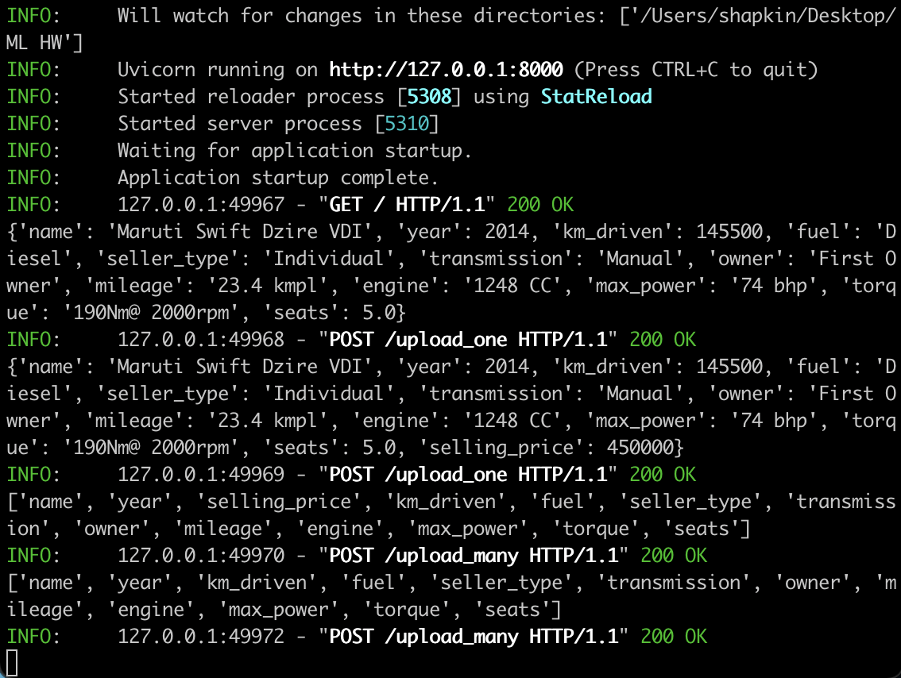

# Отчет о проделанной работе

### Постановка задачи

В данном проекте стояла задача предсказания цены автомобиля по некоторым его характеристикам. Необходимо воспользоваться моделью линейной регрессии, тк заказчик требует интерпретируемость и простоту от модели. 

### Знакомство с данными

На первом этапе я ознакомился с данными, конвертировал некоторые признаки в подходящий формат и визуализировал некоторые зависимости. Благодаря этому удалось выяснить, что при разделении на обучающую и отложенную выборки совокупности оказались похожими. Кроме того, между признаками max_power & engine наблюдается довольно сильная положительная линейная зависимость, а с целевой переменной есть явная связь у характеристик max_power, engine и year. 

### Обучение бейзлайна 

После небольшой обработки данных, были обучены модели бейзлайна: модель на вещественных признаках (с подобранным коэффициентом регуляризации, лассо регрессия) и модель на всех признаках (также с подобранным коэффициентом регуляризации, гребневая регрессия). Они выбивали следующее качество:

|       Модель       |     MSE      |   R2   |
| ------------------ |:------------:|:------:|
| Num features TRAIN | 117090306033 | 0.5915 |
| All features TRAIN |  99401395793 | 0.6532 |
| Num features TEST  | 233551443099 | 0.5937 |
| All features TEST  | 203950140255 | 0.6451 |

### Feature Engineering

Когда качество бейзлайн моделей было зафиксировано, я приступил к экспериментам по учучшению качества. В выборе моделей мы ограничены (только линейные), так что основной инструмент - Feature Engineering. Были проделаны следующие шаги: 
1. Разделение признака torque на два : max_torque_rpm и torque_only
2. Извлечение марки автомобиля из названия (извлекаем первое слово, приводим к нижнему регистру)
3. Dummy признаки для nan значений (если в каком-то показателе встречался nan - заменяем его на медианное значение, посчитанное по обучающей выборке и добавляем соответствующий dummy признак)
4. Категоризируем признак year (у таргета есть зависимость от этого признака, значит его нужно использовать на максимум. Бьем временной промежуток на десятилетия и добавляем dummy признаки каждого десятилетия)
5. Извлечение выбрасов из тренировочной выборки
6. Добавляем логарифмы численных показателей
7. Логарифмируем таргет

Пункты 1 и 2 привели к приросту качества до 0.7449 (R2) на отложенной выборке. Пункты 3, 4 и 5 оказались не столь значимыми, однако после них качество возросло до 0.7678 (R2, TEST). Самыми значимыми оказались пункты 6 и 7, разберем их подробнее. 

### Что дало наибольший буст в качестве 

Внимательно изучив распределение целевой переменной, можно заметить, что в выборке есть автомобили разных классов. Преимущественно "общедоступные" автомобили, поэтому по этим неявным классам выборки не сбалансированные. Кроме того, при предсказании цены, нам не так катастрофично ошибиться в "копейках" как ошибится в масштабе цены. Именно поэтому переход к логарифму (олицетворяющему масштаб цены) кадется логичным. Чтобы конвертировать предсказание обратно в цену: используем экспонирование.

Зачем же нужны логарифмы численных признаков? После логарифмирования целевой переменной, это экономичный способ добавить признаки вида a^b * c^d * .., ведь: 
```math
log(a^b \cdot c^d \cdot ...) = b \log a + d \log c + ...
```
где b, d, ... - будут весами в нашей регрессии и их мы и будем подбирать. 

### Итоговое качество

Итоговая модель использует все преобразования признаков и целевой переменной, описанные выше. Нам удалось значительно улучшить качество по сравнению с бейзлайн моделями, результаты в таблице:

|        Модель      |     MSE     |   R2   | Бизнес-метрика |
| ------------------ |:-----------:|:------:|:--------------:|
|     Final TRAIN    | 42854410606 | 0.9347 |      0.347     |
|     Final TEST     | 38022574256 | 0.9338 |      0.357     |

Бизнес метрика - доля предиктов, отличающихся от реальных цен на эти авто не более чем на 10%. 

### Вэб-сервис

После того, как итоговая модель была получена - я приступил к реализации вэб-сервиса при помощи FastAPI. К нему могут обращаться как IT-специалисты компании (через requests), так и любой пользователь, ведь он обладает вэб-интерфейсом. 



На вход сервис ожидает JSON файл для одного объекта в виде словаря {"feature_name": "feature value"}.



Сервис поддерживает загрузку JSON файла с истинным значением целевой переменной, что позволяет проверить предсказание на том или ином автомобиле: 



Иногда возникают ситуации, когда автомобили поступают в салон партиями и неудобно извлекать информацию по одному объекту. На помощь приходит вторая форма, которая позволяет загрузить csv файл с несколькими объектами и вернет новый файл с новым столбцом - предсказанная цена. 

Загрузка выгядит так: 



А вот что содержится в полученном файле: 



Также, как и в случае с одним объектом - возможен вариант, когда в данных содержится целевая переменная. Поведение сервиса не изменится. 





В случае, если какой-то из признаков не прописан (не содержится в столбцах csv-файла или ключах json-файла) - поведение сервиса не определено.

Сервис запускается из командной строки и на каждый запрос имеет логирование (в то же окно командной строки):





### Какие эксперименты не были произведены? 

Мы предупреждали заказчика, что у нас много дедлайнов по другим предметам и мы ограничены в наших ресурсах. По этой причине часть экспериментов не была воплощена в жизнь: 
* Парсинг дополнительной информации про название автомобилей
* Автоматизированное расширение тренировочной выборки за счет данных, выгруженных с сайтов-агрегаторов конкурентов
* Сперва предсказывать класс автомобиля (при помощи классификации), а затем в определнном классе уже цену (не удалось воплотить из-за ограничений на используемые модели) 
* Получение новых признаков, полученных на основе решающих деревьев (брать предикаты из деревьев, также не удало реализовать из-за ограничений на используемые модели)

### Итог 
Была решена задача предсказания цены автомобиля. В виду ограничений на используемую модель - пришлось провести ряд экспериментов с преобразованием признаков, в результате чего модель значительно увеличила качество (в сравнении с бейзлайном). Кроме того, был реализован вэб-сервис, позволяющий экспулатировать модель любому желающему пользователю. 
